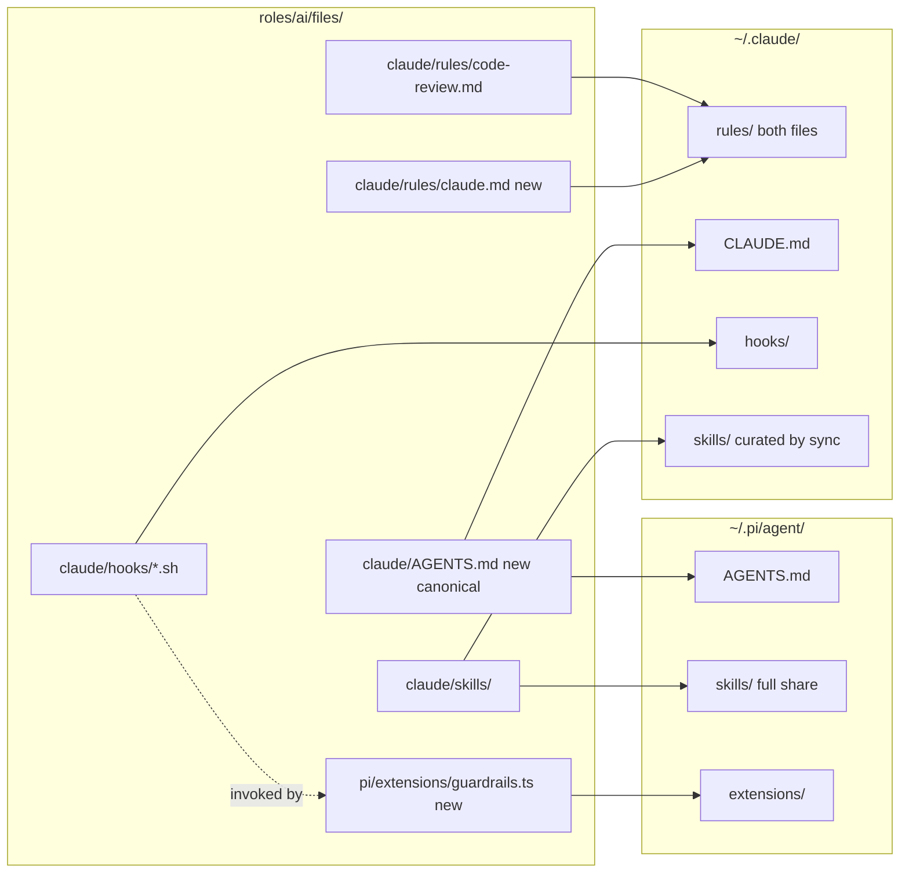

# Pi as main agent, sharing Claude's setup

Make Pi a first-class main agent by sharing the agent-neutral global instructions between Claude and Pi, porting the three enforcement hooks to Pi as a thin extension that reuses the existing hook scripts, and fixing the now-stale local-ai test that pins Pi to local models only.

## Todos

- Create `files/claude/AGENTS.md` with the agent-neutral core and move the Claude-only mechanics to `files/claude/rules/claude.md`
- Symlink `AGENTS.md` to both `~/.claude/CLAUDE.md` and `~/.pi/agent/AGENTS.md`
- Write `files/pi/extensions/guardrails.ts` adapter invoking the three hook scripts, with Pi-native skill detection for git-skill-gate
- Add `~/.pi/agent/extensions` dir and fileglob symlink task for pi extensions
- Relax `test_local_ai.py` settings pins to a subset assertion on the four stable aliases
- Update `roles/ai/README.md` and repo `CLAUDE.md`/`AGENTS.md` for the rules split and Pi guardrails
- Run `make test`; hand off `make check-role ROLE=ai` and a manual pi smoke test

## Current state (review summary)

Already working on both agents:

- Pi installed via brew; `settings.json`, `models.json`, `SYSTEM.md`, themes symlinked into `~/.pi/agent/` by [roles/ai/tasks/main.yml](../../roles/ai/tasks/main.yml)
- All skills shared: `~/.pi/agent/skills` -> `files/claude/skills` (Pi follows the same Agent Skills standard, so `/skill:commit`, `/skill:pr` etc. already exist in Pi). Kept as-is per your decision.
- Project instructions: Pi natively reads `CLAUDE.md`/`AGENTS.md` from cwd and parents, so per-repo context already works
- `local-ai` stable aliases, offline Ollama policy, `pi-review` + `plannotator` packages

Claude-only with no Pi counterpart today:

- Global instructions (`~/.claude/CLAUDE.md` + `~/.claude/rules/*.md`); Pi's one global context file, `~/.pi/agent/AGENTS.md`, is unpopulated
- Enforcement hooks: `em-dash-gate.sh`, `git-skill-gate.sh`, `pre-commit-verify.sh`

Not portable, stays Claude-only (Pi has no subagents/plan mode by design): seat plugins, `architect`/`ux-shaper`, product-team pipeline, `plan-date-stamp.sh`, `skill-recap.sh`, `cloud-readonly-gate.sh`, statusline, tokencost, herdr, rtk hook.

Broken now: `test_pi_config_exposes_only_stable_aliases_for_model_cycling` in [roles/ai/files/scripts/local-ai/tests/test_local_ai.py](../../roles/ai/files/scripts/local-ai/tests/test_local_ai.py) pins `defaultProvider == "local"` and exactly four `enabledModels`, but the working-tree [roles/ai/files/pi/settings.json](../../roles/ai/files/pi/settings.json) defaults to `openai-codex` with Codex/Grok models enabled, so `make test` fails.

## Sharing map after this change

## 1. Split the global instructions

`roles/ai/files/claude/AGENTS.md` is the canonical file, holding the agent-neutral core:

- Tools & CLIs table and the ctx7 docs-first rule (generalizing the one Claude-specific clause about `claude-api`/`claude-code-guide`)
- Code standards: complete code, comment policy, ADR shape, no hardcoded values, doc length, em/en dash ban, semantic line breaks, wrap width, `docs/plans/` location
- Git conventions: Conventional Branch naming, commits/pushes through the `commit`/`pr` skills (phrased so it reads correctly as `/commit` in Claude and `/skill:commit` in Pi), no attribution lines

The Claude-only mechanics move out to `roles/ai/files/claude/rules/claude.md`: the `attribution` setting note, plan-date-stamp/plan-mode bullets, sandbox and acli behavior, hook-enforcement phrasing.
`AGENTS.md` rather than a `conventions.md` beside it, because the neutral file is the one both agents load and each expects a different name for it: naming the shared thing after either agent would have made one of the two links read as a lie. `rules/claude.md` needs no Ansible change, since the existing rules glob task in [roles/ai/tasks/main.yml](../../roles/ai/tasks/main.yml) links every `files/claude/rules/*.md` into `~/.claude/rules/`, which loads at launch with the same priority as `CLAUDE.md`. Claude reads exactly the same text as before, in two files instead of one.

`code-review.md` stays Claude-only for now (it routes to seat plugins and `/code-review` levels that do not exist in Pi; Pi has `pi-review` installed).

## 2. Give Pi the shared instructions

Both links live in [roles/ai/tasks/main.yml](../../roles/ai/tasks/main.yml), and only one of them needed a new task. Pi's is an entry in the existing pi config loop: that loop derives its destination from the source basename, so `claude/AGENTS.md` lands at `~/.pi/agent/AGENTS.md` on its own, the same precedent as the skills share (Pi reads the file directly, no second copy). Claude's needed its own task, because there the source and destination names differ, and `CLAUDE.md` therefore left the claude config loop.

Pi concatenates `AGENTS.md` with project-level `CLAUDE.md`/`AGENTS.md` automatically. `SYSTEM.md` stays as-is (harness rules).

## 3. Port the three enforcement hooks as one Pi extension

New `roles/ai/files/pi/extensions/guardrails.ts`, a thin adapter, with the logic staying in the already-tested Python hook scripts:

- Listens on Pi `tool_call` events for `write`, `edit`, `bash`
- Builds Claude-hook-compatible JSON (`tool_name` mapped to `Write`/`Edit`/`Bash`, `tool_input` fields mapped from Pi's tool args, `cwd`), spawns the corresponding script from this checkout, blocks the tool call with the script's stderr when it exits 2
- `em-dash-gate.sh` and `pre-commit-verify.sh` work unchanged (neither needs a transcript)
- `git-skill-gate.sh`: the hard blocks (`--no-verify`, attribution lines and dashes in commit messages, staged `.claude/tasks/`) work unchanged; the skill-window check reads Claude's `attributionSkill`, which Pi does not have. The extension does the Pi-side equivalent natively: detect whether `/skill:commit` / `/skill:pr` was invoked in the current session (Pi exposes session messages to extensions) and block gated commands itself when not. If that marker proves unreliable during implementation, v1 falls back to hard-blocks-only in Pi, stated in the extension header.

Wiring in [roles/ai/tasks/main.yml](../../roles/ai/tasks/main.yml): add `~/.pi/agent/extensions` to the directories task and add a fileglob symlink task for `files/pi/extensions/*.ts`, mirroring the themes task. Pi auto-discovers extensions there; no settings.json change.

## 4. Fix the stale local-ai test

In [roles/ai/files/scripts/local-ai/tests/test_local_ai.py](../../roles/ai/files/scripts/local-ai/tests/test_local_ai.py), change `test_pi_config_exposes_only_stable_aliases_for_model_cycling` to assert the four stable `local/...` aliases are a subset of `enabledModels` (the invariant local-ai actually needs), dropping the `defaultProvider`/`defaultModel` equality pins that contradict Pi-as-main-agent. `test_pi_models_have_matching_32k_and_64k_stable_profiles` stays as-is.

## 5. Docs

- [roles/ai/README.md](../../roles/ai/README.md): document the AGENTS.md share, the guardrails extension, and that Pi is a first-class agent
- Repo [CLAUDE.md](../../CLAUDE.md) / [AGENTS.md](../../AGENTS.md): note the rules split (agent-neutral conventions vs Claude-only mechanics) and the Pi extension

## Verification

- `make test` (unattended) covers the hook scripts and the fixed local-ai test
- `make check-role ROLE=ai` for the new symlink tasks (needs vault password, run by you)
- Manual: launch `pi` in a repo, confirm the startup header lists AGENTS.md + the extension, then try a raw `git commit` and an em dash write to see the blocks

## Out of scope (noted for later)

- Statusline extension for Pi, tokencost over Pi sessions (`~/.pi/agent/sessions/` JSONL has token/cost data), curating Pi's skill list, sharing `code-review.md` with Pi
- `SYSTEM.md` currently replaces Pi's default system prompt entirely; `APPEND_SYSTEM.md` would append instead. Left as-is, flag if you want it changed.
