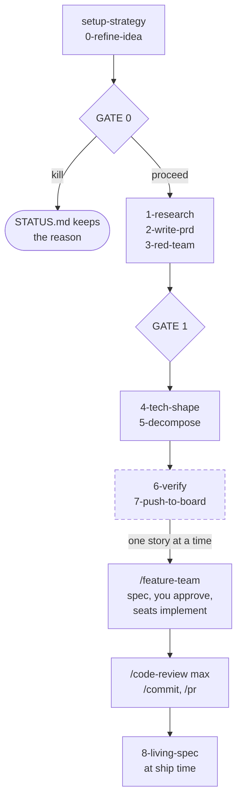

# Starting from zero

The worked example. [README.md](README.md) is the reference (what every piece is, how it is registered, why it is shaped that way); this file is the walkthrough (what you actually type, in what order, and what lands on disk).
Read this one first when you come back to this setup after six months away.

Everything below was run against this repo's catalogue, so the commands are literal.

## The two halves

There are two systems here and they meet at exactly one artifact, a story.



Gate 0 asks whether this is worth building at all and Gate 1 whether the requirements are the right ones; kill is a first-class answer to both. The dashed pair is what `profile: solo` drops, along with the `05-backlog/` story headers and all PR machinery, and nothing that produces a finding is ever dropped.

Stages are grouped between the gates rather than drawn one box each, and which artifact each one writes is in the walkthrough below instead of in the diagram, so there is one copy of that list to keep true.

Three rules hold across both halves, and they are the ones to remember:

- **The filesystem is the orchestrator.** No process is long-running. Each stage reads the previous stage's file from disk and writes its own, so a session that dies loses nothing. Which stage is next is derived from what is on disk, never from a table someone maintained.
- **Every gate is a human.** Two product gates, answered in the conversation by default and recorded in `STATUS.md` with the reason that convinced you (`gate_medium: pr` turns each one into a reviewed PR instead); the engineering gate is you approving the architect's spec before any seat is dispatched.
- **No agent ever commits, pushes, or merges.** Agents write files. You run `/commit` and `/pr`.

## What you already have in every repo

`claude-kit sync` links everything tagged `global` into `~/.claude`, so these need no install and work in any directory:

| Command or agent | Use it for |
|---|---|
| `/feature-team "<brief>"` | The whole engineering pipeline: architect spec, approval gate, parallel seat dispatch, integration report |
| `architect` agent | Design only: writes `docs/specs/<feature>.md` plus ADRs, dispatches nothing |
| `ux-shaper` agent | UI only: writes a UX spec (flows, surfaces, every state, the design-system pieces that are missing) for the architect or a stage to design against |
| `/grill-me "<idea>"` | A relentless interview that sharpens a fuzzy brief before it costs you a bad spec |
| `/grill-with-docs` | The same, with the library docs pulled in |
| `/research "<question>"` | Multi-source research write-up |
| `/commit`, `/pr` | The only supported git write paths (a hook enforces this) |
| `/handoff` | Compact a dying session into a doc the next one can pick up |
| `/cc-review`, `agent-audit`, `skill-writer`, `agent-writer` | Maintaining this setup itself |
| `/product-lead` | A signpost that tells you the pipeline is a plugin and hands you the install line |

Everything else is opt in, per project. That is deliberate: the product pipeline writes into `docs/` of whatever repo it runs in, and a seat you never dispatch is context you pay for on every turn.

## Step 0: bootstrap a repo

```console
$ mkdir ledger && cd ledger && git init
$ claude
```

Accept the trust dialog. Then let the catalogue tell you what belongs here:

```console
$ claude-kit scout
```

`scout` fingerprints the directory and ranks the catalogue against it, with the evidence printed beside each row (`react@19.0.0 in package.json`, `no test directory and no test files`). An empty repo has no fingerprint yet, so on a true greenfield you install by intent instead:

```console
$ claude-kit add product-team --type plugin      # the product pipeline
$ claude-kit add --group engineering --type plugin  # 13 staff-engineer seats
$ claude-kit add qa --type plugin                 # qa is tagged quality, not engineering
```

Install fewer if you know the shape of the work: `claude-kit add frontend backend database --type plugin` is the common trio. Seats are cheap to add later, and `/feature-team` tells you exactly which one is missing when the spec needs it.

**Two things every plugin install needs, and both are easy to forget:**

1. The workspace must be **trusted**.
2. Claude must be **relaunched from the repo root** afterwards.

Until both hold, `/product-team:setup-strategy` does not exist and `claude plugin list` shows nothing. `claude-kit add` prints this hint on every plugin install.

After the relaunch, re-run scout once the repo has a `package.json` (or `go.mod`, or `pyproject.toml`) so it can see the stack and offer the matching skills:

```console
$ claude-kit scout --type skill
$ claude-kit scout --add        # installs the strong tier only
```

## Scenario 1: a new product, from nothing

Greenfield. You have an idea and an empty repo. Running example: *Ledger*, a subscription-spend tracker for small teams.

### Product side

**1. Strategy, once per repo.**

```
/product-team:setup-strategy
```

It interviews you one question at a time for vision, 3-5 bets, non-bets, and OKRs, then writes `docs/strategy/strategy.md`, `docs/strategy/okrs.md` and `docs/strategy/product-team.yml`, and scaffolds the repo. Arrive with a raw idea instead of a strategy and it runs `/idea-refine` first, whose one-pager in `docs/ideas/` seeds the interview. The numbers are always yours: it will not invent a baseline.

`product-team.yml` is worth a look before you go further. It holds the **profile** (`full`, or `solo` to drop stories, the readiness report, the board export and all PR machinery), the **gate medium** (`session` to answer a gate in the conversation, `pr` to answer it as a review), and the **roster** of agents each stage dispatches. Two gates exist, not four.

Then `/commit`. Merge before running any initiative.

**2. Open the initiative.**

```
/product-team:0-refine-idea "let a team see every subscription they pay for in one place"
```

Writes `docs/initiatives/subscription-visibility/00-brief.md` and `STATUS.md`, and dispatches `product-team:strategy-checker` for a blunt fit verdict against the strategy you just wrote. Then it asks you **Gate 0**: proceed, or kill.

A healthy funnel kills most ideas here. Killing at Gate 0 is the pipeline working. Whatever you answer, the reason goes in `STATUS.md` next to your name: a gate that records only "approved" is indistinguishable from one nobody read.

**3. Research, PRD, red team, and Gate 1.**

```
/product-team:1-research      # the roster's researchers, in parallel
/product-team:2-write-prd     # 02-prd.md: SHALL requirements, each with WHEN/THEN scenarios
/product-team:3-red-team      # pm-red-team attacks the PRD, fixes fold back in  → Gate 1
```

Requirements are written as `### R3: {name}` plus a SHALL sentence plus `#### R3.S1` scenarios. Those scenario ids are the traceability currency for everything downstream, so a story claims `R3.S1` rather than restating it.

Gate 1 comes after the red team on purpose. It is the requirements gate, and requirements worth approving are the ones that have survived an attack; on a real initiative the gate was answered first and the report then had to amend an already-approved PRD.

**4. Technical shape, then decompose.**

```
/product-team:4-tech-shape    # 04-ux-spec.md + 04-design-doc.md + ADRs
/product-team:5-decompose     # 05-tasks.md, plus thin story headers in the full profile
/product-team:6-verify        # runs pt.py check, then judges what a script cannot
```

No gate on either. The design gate went because the open decisions at that stage resolve unaided, and the ADRs it used to review are now covered by a `docs/adr/` line in CODEOWNERS. The readiness gate went too, because its mechanical half is now a script:

```
python3 .claude/skills/product-team/skills/product-lead/scripts/pt.py check subscription-visibility
```

That decides scenario coverage (every requirement claimed by some story or task), id resolution, UX anchors, deferral closure, and size rationales. Run it yourself whenever you like; `6-verify` runs it first and never re-decides it.

`05-tasks.md` is the layer that used to be missing: the whole build, dependency-ordered from an empty repo to accepted, including the toolchain, deploy and acceptance work that could never be a story because no requirement asks for it.

**5. Push to the board, then record what shipped.**

```
/product-team:7-push-to-board   # full profile only
/product-team:8-living-spec     # at ship time, not before
```

Stage 7 dry-runs first and waits for your Go, then creates the GitHub epic and story issues with each story's claimed scenarios expanded into the body, links them, and adds them to the Project.

Stage 8 is the one that outlives the initiative. When a requirement's tasks are all checked off, it merges that requirement into `docs/specs/{capability}/spec.md`, so the repo carries a current description of what the system does rather than a folder of proposals going stale. It appends the retrospective to `docs/LEARNINGS.md` too.

Lost at any point:

```
/product-team:product-lead
```

It runs `pt.py status` over every initiative and tells you the exact next command. Nothing maintains a stage table: which stage is next is derived from the files on disk.

### Engineering side

The handoff is the story file, not the epic. Work **one story at a time**: a story is already the unit `/feature-team` and `architect` are built around.

**6. Take the lowest-id PASS story and run the team.**

```
/feature-team "Story 1.2 - export the subscription list as CSV.
Story: docs/initiatives/subscription-visibility/05-backlog/story-1.2.md (the scenario ids it claims are the acceptance bar)
Requirements: docs/initiatives/subscription-visibility/02-prd.md (where those R#.S# scenarios are written)
Constraints: docs/adr/ (accepted ADRs are immutable)"
```

Three anchors, always: the story, the PRD, the ADR directory. What happens next:

1. It restates the brief and confirms scope. If it is fuzzy it stops and suggests `/grill-me` first.
2. It inventories the installed seats (`.claude/agents/`, `~/.claude/agents/`, `claude plugin list`) and names any missing one with the exact `claude-kit add` line.
3. It dispatches `architect`, which explores read-only and writes `docs/specs/csv-export.md` with an owner-split work breakdown, exact cross-slice contracts, and ADRs for hard-to-reverse choices.
4. **It stops at the approval gate** and shows you the objective, acceptance criteria, owner split, and decision items. Nothing is implemented until you say so. It is cheaper to fix a bad plan than bad code.
5. On approval it dispatches every slice marked `Parallel: yes` in one message so they run concurrently, in isolated git worktrees when there are 2+ of them.
6. It integrates the wave back into the main checkout, runs the held slices in dependency order, and returns an integration report: per-seat status, criteria met and unmet, pending ask-first items, gotchas worth adding to `CLAUDE.md`.

**7. Close the loop.**

```
/code-review max      # on the combined diff
/commit
/pr
```

Then move the issue to Done and pick the next PASS story.

**Two design docs, one decision record.** `4-tech-shape` already wrote `04-design-doc.md` and the architect writes its own `docs/specs/<feature>.md`. Either point the architect at the design doc so it inherits those decisions, or let it design fresh from the PRD as an independent check. `docs/adr/` is the shared tie-breaker either way: a spec honors an accepted ADR and supersedes it, never edits it.

**One UX spec, though.** Point the architect at `04-ux-spec.md` rather than letting it ask for a second one: the states a surface can reach were reviewed and possibly rewritten by the design owner where CODEOWNERS names one, so re-deriving them from the PRD throws that review away. Outside the pipeline the architect has no UX spec to read, and for a brief touching UI it returns `needs-decision` asking you to run `ux-shaper` first. It cannot dispatch the agent itself, by design: orchestration stays with you.

## Scenario 2: a new feature in an existing product

Same pipeline, less of it. The only real difference is that stage 4 has a real codebase to read.

1. `claude-kit scout` in the repo, install what it suggests, plus `product-team` if the repo runs initiatives.
2. `/product-team:setup-strategy` **once**, if `docs/strategy/` does not exist yet. Skip it forever after.
3. Every feature is its own initiative: `/product-team:0-refine-idea` through `/product-team:8-living-spec`.
4. Stage 4 reads the real code, cites `path:line` for every design claim, fits the existing patterns, and numbers new ADRs after the ones already in `docs/adr/`.
5. Engineering side is identical: one story, `/feature-team`, review, commit.

`docs/strategy/` and `docs/adr/` are shared across every initiative in the repo. Only `docs/initiatives/{slug}/` is per-feature.

## Scenario 3: one engineering task, no pipeline

Most work is this. A single seat, dispatched directly, no architect and no `/feature-team`.

> `/feature-team` earns its overhead when the work spans two or more seats or needs a spec first. Below that, it is a tax.

Ask for the seat by name in the conversation:

```
Dispatch backend:backend-staff-engineer with this brief:

Goal: add cursor pagination to GET /subscriptions, which currently returns every row.
Owns: src/routes/subscriptions.ts, src/services/subscription-list.ts, and their tests.
Acceptance:
  1. `?cursor=&limit=` with limit defaulting to 50 and capped at 200.
  2. Response carries `nextCursor`, null on the last page.
  3. Existing callers with no cursor param keep working unchanged.
Note: pre-authorized to add an index migration if the sort key needs one.
```

The name matters. A seat installed as a plugin is namespaced by the plugin, so the agent is `backend:backend-staff-engineer`, not `backend-staff-engineer`. `claude plugin list` shows the plugins (`backend@skills-dir`); the agent inside carries the prefix.

A brief that works has four parts, and they are the same four the architect emits per slice:

| Part | Why it matters |
|---|---|
| **Goal**, one sentence | The seat restates it back; a goal it cannot restate is a goal it will invent |
| **Owns**, explicit paths | One file, one owner. This is the whole collision story in a parallel wave, and it keeps a solo dispatch from wandering |
| **Acceptance**, numbered | It is what the seat self-verifies against, and what its report maps to line by line |
| **Note**, pre-authorizations | Schema changes, new dependencies, and backfills sit behind a seat's ask-first boundary. Say yes in the brief or it stops and asks |

What comes back is a **completion report**, not a chat reply: status (`done` / `blocked` / `needs-decision`), stack detected, changes per file, verification with real command output, decisions and rejected alternatives, pending ask-first items, and discovered gotchas. Read the Verification section. `not runtime-verified` is an honest answer and it means the check is yours.

Then `/code-review high`, `/commit`.

Which seat owns what is the table in [README.md](README.md#staff-engineer-bench). Fifteen ship: analytics, backend, cloud, data, database, design, desktop, dx, frontend, gtm, mobile, platform, qa, security, sre. Two are not implementers:

- **`security:security-staff-engineer`** is read-only and advisory: threat models, dependency audits, authn/authz review. It never edits. For a pending diff use `/security-review` instead.
- **`architect`** designs and never implements.

## Scenario 4: an engineering task managed by the architect

Between Scenario 1 and Scenario 3. The work is real design work but there is no PRD behind it, or you want the spec without the automatic dispatch.

Dispatch the architect alone:

```
Dispatch the architect agent: design the migration from our session cookies to
short-lived JWTs with refresh rotation. Read src/auth/ and docs/adr/. I want the
spec and the owner split; do not dispatch anyone.
```

It returns a design report of about 40 lines pointing at `docs/specs/<feature>.md`, plus dispatch-ready briefs per seat. Three things to check before you act on it:

1. **Status.** `needs-decision` means it hit a foundational fork (an answer that would change the data model, the owner split, or the feature's meaning) and refused to write a speculative spec. Answer the fork and re-dispatch.
2. **Decision items.** Minor ambiguities it resolved itself, each with the recommendation and the default the spec was built on. This is where a wrong assumption is cheapest to catch.
3. **Contracts.** Every cross-slice interaction written verbatim in the project's own idiom. If two seats are going to build against it in parallel, this is the section that has to be right.

Then dispatch the briefs yourself, one seat per message for a serial build, or all the `Parallel: yes` ones in a single message to run them concurrently. You are doing by hand what step 6 of `/feature-team` does; the difference is only that you chose to hold the wheel.

The architect **cannot** dispatch: the Agent tool is disallowed in its frontmatter. That is the design, not a limitation to work around.

## Scenario 5: a bug fix

No pipeline, no architect, often no seat.

- One file, obvious cause: just fix it in the main conversation, then `/commit`.
- A Sentry issue: `/fix-sentry-issues`.
- Non-obvious cause, or a fix that spans a module: dispatch the owning seat with a Scenario 3 brief where the acceptance criterion is the failing behaviour.
- Missing or flaky tests around it: `qa:qa-staff-engineer` owns test infra and flake diagnosis, and never modifies application source (it reports product bugs back to you).

## Choosing the entry point

| Situation | Start with |
|---|---|
| An idea, no repo, no strategy | `/product-team:setup-strategy` |
| A strategy exists, a new idea arrives | `/product-team:0-refine-idea` |
| A PASS story on the board | `/feature-team "<story>"` |
| A clear feature spanning 2+ seats, no PRD | `/feature-team "<brief>"` |
| Design needed, dispatch not wanted | `architect` alone |
| One seat's worth of work | Dispatch that seat directly |
| The brief is fuzzy | `/grill-me` first, always |
| A diff needs review | `/code-review high`, `max` for a multi-seat integration (the effort table is in the review policy), or `/security-review` for the security lens |
| A security assessment of the system, not a diff | `security:security-staff-engineer` |
| Context is running out mid-task | `/handoff` |

## Gotchas

**Plugins.** `--type` is required on `add`, `remove` and `list`; nothing is inferred from a name. A plugin needs workspace trust plus a relaunch before it loads. The plugin name is the discipline (`qa`), while the agent inside carries the namespace (`qa:qa-staff-engineer`); `claude-kit add` takes the former.

**`~/.claude` is owned by the registries.** `claude-kit add --global` on an artifact not tagged `global` is a scratch change: it survives until the next `claude-kit sync` and no longer. To make something durably global, tag it `global` in the registry. Removing a global link by hand is undone the same way.

**Worktrees.** A parallel wave runs in `.claude/worktrees/`, branched from committed HEAD. Uncommitted work in the feature's blast radius is invisible to it, so `/feature-team` checks `git status --porcelain` first and offers `/commit` or `--no-isolate`. This needs `worktree.baseRef: "head"` in [settings.json](settings.json), which is set. The `wt` fish helper is deliberately not wired in: its sibling worktrees fall outside the sandbox write root.

**One file, one owner.** If two dispatch briefs claim the same file, fix the split before dispatching. The worktree fences build side effects; it does not resolve two seats writing the same source file.

**Agents do not commit.** Not the seats, not the architect, not the product stages. If something needs to land in git, that is `/commit` and `/pr` in the main conversation.

**Stages block on the files, not on a table.** A stage refuses to run when `pt.py status` reports it `blocked`, and it names the missing artifact and the command that produces it. `STATUS.md` holds only what a file listing cannot derive: who decided each gate, when, why, which stages were skipped, and the kill reason. There is no stage table to hand-edit, and no skill may write one.

**`partial` is not a reason to re-run a stage.** It means an older initiative finished that stage before one of its artifacts existed (the two initiatives in this repo that predate `04-ux-spec.md`, for instance). The missing file is named, so nothing is left to guess.

**No remote is a profile, not a mode.** `profile: solo` plus the default `gate_medium: session` is how a repo with no `origin` runs the pipeline: both gates answered in the conversation, no PR machinery, no board. Stage 7 is the one that cannot run, since it needs a real repo and a Project number.

## Where each thing is defined

| Thing | File |
|---|---|
| The reference for all of this | [README.md](README.md) |
| Keeping a session cheap, and what is not worth optimising | [CONTEXT-TIPS.md](CONTEXT-TIPS.md) |
| Product pipeline mechanics (layout, the two gates, profiles, deferrals) | [plugins/product-team/skills/product-lead/references/conventions.md](plugins/product-team/skills/product-lead/references/conventions.md) |
| Product gate protocol per medium, and the revision flow | [plugins/product-team/skills/product-lead/references/gates.md](plugins/product-team/skills/product-lead/references/gates.md) |
| The engineering pipeline, step by step | [skills/feature-team/SKILL.md](skills/feature-team/SKILL.md) |
| The spec contract and the ADR rules | [agents/architect.md](agents/architect.md) |
| The UX spec contract (flows, surfaces, the state matrix) | [agents/ux-shaper.md](agents/ux-shaper.md), [plugins/product-team/skills/product-lead/references/templates/ux-spec.md](plugins/product-team/skills/product-lead/references/templates/ux-spec.md) |
| A seat's anatomy, boundaries and report contract | `plugins/<discipline>/agents/<discipline>-staff-engineer.md` |
| A seat's failure-mode checklists | `plugins/<discipline>/skills/<discipline>-failure-modes/` |
| `claude-kit` full reference and FAQ | [../scripts/claude-kit/README.md](../scripts/claude-kit/README.md) |
| Which artifacts are global, and the group vocabulary | [skill-registry.json](skill-registry.json), [agent-registry.json](agent-registry.json) |
